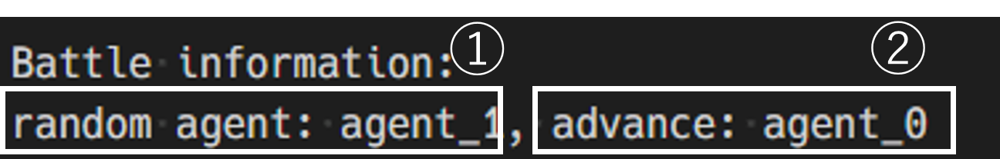
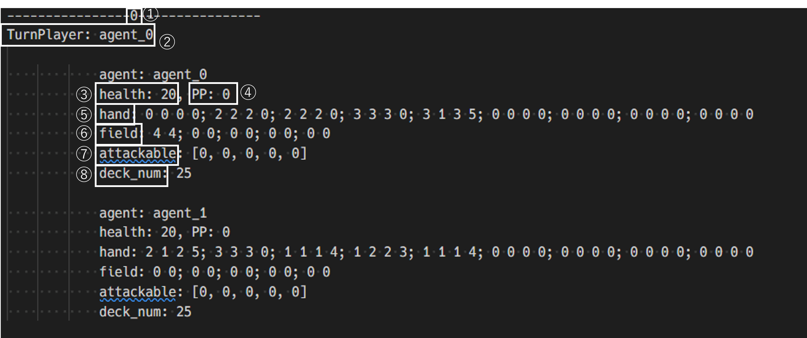

# カードゲームの強化学習

こちらの論文を参考に作成: https://www.jstage.jst.go.jp/article/pjsai/JSAI2023/0/JSAI2023_2M5GS1002/_pdf/-char/ja

ボード情報（論文より引用，拡張性を考慮して一部変更）

|項目|次元数|上限|下限|
|---|---|---|---|
|各プレイヤーの体力|2|20|0|
|各プレイヤーのマナ|2|8|0|
|手札の攻撃力，HP，コスト，体力|36|8|0|
|自盤面の攻撃力，HP|10|8|0|
|相手盤面の攻撃力，HP|10|8|0|
|自盤面が攻撃可能か|5|1|0|
|各プレイヤーのデッキ枚数|2|30|0|

各エージェントが自分のターン中に取れる動き

- 手札9枚のうち1枚をプレイ（コストを支払って場に出す，カードが能力を持っている場合は能力発動）
- 自盤面5枚のうち1枚で相手盤面のカードor相手プレーヤーを攻撃
- ターンエンド

各行動にはaction_idが付与されている
| action_id | 行動                                                                                                            |
| --------- | --------------------------------------------------------------------------------------------------------------- |
| 0～8      | 手札0～8のうち{action_id}のカードをプレイ                                                                       |
| 9～14     | 自盤面0のカードで相手盤面{(action_id - 9) % 6}のカードを攻撃 ((action_id - 9) % 6 = 5のときは相手リーダーを攻撃) |
| 15～20    | 自盤面1のカードで相手盤面{(action_id - 9) % 6}のカードを攻撃 ((action_id - 9) % 6 = 5のときは相手リーダーを攻撃) |
| 21～26    | 自盤面2のカードで相手盤面{(action_id - 9) % 6}のカードを攻撃 ((action_id - 9) % 6 = 5のときは相手リーダーを攻撃) |
| 27～32    | 自盤面3のカードで相手盤面{(action_id - 9) % 6}のカードを攻撃 ((action_id - 9) % 6 = 5のときは相手リーダーを攻撃) |
| 33～38    | 自盤面4のカードで相手盤面{(action_id - 9) % 6}のカードを攻撃 ((action_id - 9) % 6 = 5のときは相手リーダーを攻撃) |
| 39        | ターン終了 |

また各カードの能力には以下のように数値が対応している．
| ability_id | 能力                                    |
| ---------- | --------------------------------------- |
| 0          | 能力なし                                |
| 1          | (攻撃力/体力)=(1/1)のカードを追加で召喚 |
| 2          | 自分のリーダーの体力を2回復             |
| 3          | 相手のリーダーに2ダメージ               |
| 4          | カードを1枚引く                         |
| 5          | 場に出たターンに攻撃できる |

学習方法はDQN(Deep Q-Learning)


## 各ファイルの説明

- env.py 
  - 強化学習の環境が書かれたファイル
  - ~PettingZooのParallelEnvで書かれている~
  - 2人のランダムエージェントの学習ではうまく勝率が上がらないことに気づき，ある程度合理的に動くエージェントと対戦させる環境(TCGENV_v2)を作成
  - また，最近ではデッキを構築させるために試合の前にデッキ構築フェーズがある
- learn.py
  - 強化学習を行うファイル
  - DQNで学習する（ハイパラはファイル参照）
- eval.py
  - 学習したモデルのq値を見るためのファイル
  - あまり使っていない
- test.py
  - 学習したモデルで推論のテストを行うファイル
  - エージェントの行動はlog.txtに出力される
  - 勝率計算にも使っている
  - calculate_win_numではランダム行動をするエージェントと学習済みエージェントの対戦の勝率を返す
- memo.md
  - 強化学習の報酬が記載されたファイル
  - 今後他の内容も乗せる可能性あり
- taste.py
  - 紹介用のファイル

## 使い方
### はじめに
まず初めに諸パッケージをインストールするために以下のコードを実行してください．
```
pip install -r requirements.txt
```
### プログラムの動かし方
以下ではランダムに行動するエージェントをランダムエージェント，モデルにしたがって行動するエージェントをモデルエージェントと呼ぶ
- 基本的にはtaste.pyを使っていただきたい
- 使用するときは以下のようにして起動する
```
python .\taste.py --model_name dqn_tcg_v2 --mode calculate
```
- コマンドライン引数
  - model_name...使うモデルの名前を入力する．使えるモデルはmodelsの中にあるもののみ．
  
    おすすめはdqn_tcgとdqn_tcg_v2（学習の改良前がdqn_tcg，改良後がdqn_tcg_v2）
  - mode...行う処理を入力する．選択肢は['battle', 'calculate']で，'battle'はlog.txtにランダムエージェントとモデルエージェントのbattleの様子が記述される．'calcurate'はモデルエージェントのランダムに対する勝率が表示される

### log.txtの見方
- log.txtは始めの2行とそれ以降で分けられる
- 始めの2行は以下のような情報が乗っている


  ①random_agent...ランダムに行動するエージェント (agent_0 or agent_1)
  ②advance...先行プレイヤー (agent_0 or agent_1)
- それ以降は以下のようなブロックが続いていく


  ①選択されたアクションのaction_id．
  ②TurnPlayer...現在ターン中のプレイヤー．
  ③health...リーダーの体力．上限値以上は回復しない．
  ④PP...プレイポイント．このポイントを消費してカードを場に出す．
  ⑤hand...手札情報．カード枚数は9枚で0 0 0 0の場所にはカードは存在していない．4つ組の数字は左から攻撃力，体力，コスト，能力である．
  ⑥field...場の情報．上限は5枚で0 0の場所にはカードは存在しない．2つ組の数字は左から攻撃力，体力である．
  ⑦attackable...場にあるカードが攻撃可能かどうかの数字．
  ⑧deck_num...デッキ枚数

## 用いているライブラリ
- gymnasium
- pettingzoo
- stable-baseline3
- pytorch
- supersuit
- isort
- tqdm

